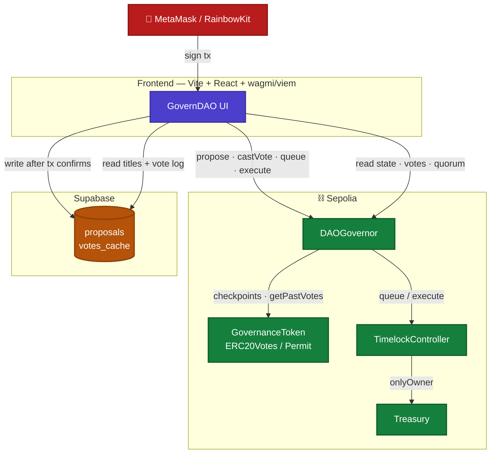
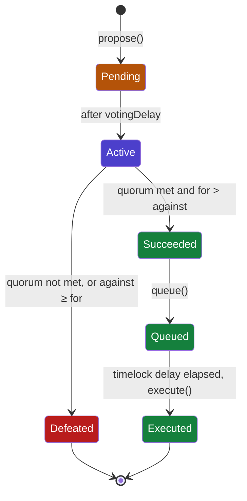

# GovernDAO

An on-chain governance dApp on Sepolia: an ERC20Votes governance token, an OpenZeppelin
`Governor` with timelock-gated execution, and a `Treasury` contract that only successful,
queued, and time-delayed proposals can mutate. The frontend reads proposal/vote state live
from the chain and uses Supabase purely as a cache for human-readable metadata.

**Live:** [governdao.vercel.app](https://governdao.vercel.app)

## Architecture



The frontend talks directly to the chain for every state/vote read and every write; Supabase
is written to only *after* a transaction receipt confirms, and only stores human-readable
proposal metadata + a vote log for display — it never holds tallies or execution state.

## Governance lifecycle



Testnet parameters (see `contracts/scripts/deploy.ts`): 1-block voting delay, 300-block voting
period (~60 min on Sepolia), 0 proposal threshold, 4% quorum, 300-second timelock delay.
Production deployments should use much larger values (documented inline in the deploy script).

## Repository layout

```
governdao/
├── contracts/    Hardhat + Solidity 0.8.24 + OpenZeppelin 5.1.0
├── frontend/     Vite + React + TypeScript + Tailwind + wagmi/viem + RainbowKit
└── supabase/     schema.sql (proposals + votes_cache, RLS: public read, anon insert-only)
```

Two independent npm packages — no monorepo tooling.

## Setup

### Contracts

```bash
cd contracts
npm install
cp .env.example .env   # fill in SEPOLIA_RPC_URL, PRIVATE_KEY, ETHERSCAN_API_KEY
npx hardhat compile
npx hardhat test
```

### Frontend

```bash
cd frontend
npm install
cp .env.example .env   # fill in WalletConnect / Supabase / contract addresses
npm run dev
```

## Local end-to-end demo (no Sepolia ETH needed)

```bash
cd contracts
npx hardhat node                    # in one terminal
npm run demo:localhost              # in another: deploys fresh contracts, funds
                                     # 10 accounts, creates a proposal, votes, executes
```

This writes `frontend/.env.local` with the local contract addresses and `VITE_CHAIN_ID=31337`,
which Vite loads *on top of* `frontend/.env` — so local testing never touches your real Sepolia
or Supabase configuration. Run `npm run dev` in `frontend/` afterward and switch your wallet to
the Hardhat network (chain id `31337`, RPC `http://127.0.0.1:8545`) to see it live.

## Deploy to Sepolia

```bash
cd contracts
npm run deploy:sepolia
```

This runs the deterministic sequence in `scripts/deploy.ts`:

1. Deploy `GovernanceToken` (1,000,000 GDAO minted to the deployer).
2. Deploy `TimelockController` (300s min delay, deployer as temporary admin).
3. Deploy `DAOGovernor` wired to the token and timelock.
4. Deploy `Treasury` owned by the timelock.
5. Grant `PROPOSER_ROLE`/`CANCELLER_ROLE` to the governor, `EXECUTOR_ROLE` to `address(0)`
   (open execution), then **renounce `DEFAULT_ADMIN_ROLE` from the deployer** — this is the
   step that removes any privileged backdoor over the timelock.
6. Self-delegate the deployer's tokens so it can vote immediately.
7. Write `contracts/deployments/sepolia.json` and print `hardhat verify` commands for all
   four contracts with their exact constructor arguments.

Run the printed `npx hardhat verify --network sepolia ...` commands to verify each contract
on Etherscan.

## Supabase setup

1. Create a Supabase project.
2. Open the SQL editor and paste the contents of `supabase/schema.sql`, then run it.
3. Copy the project URL and anon key into `frontend/.env`.

Supabase is a read cache for proposal titles/descriptions and a vote log for the UI — it is
never the source of truth. Proposal/vote **state** (quorum, vote tallies, execution status) is
always read live from the chain. Rows are written client-side only after a transaction receipt
confirms, and RLS policies permit `select`/`insert` only (no `update`/`delete`), so the log is
append-only via the anon key.

## Deploy to Vercel

1. Import the `frontend/` directory as the project root in Vercel (Root Directory = `frontend`).
2. Set the environment variables from `frontend/.env.example` in the Vercel project settings.
3. Deploy — `vercel.json` rewrites all routes to `index.html` for client-side routing.
4. Connect the GitHub repository (`vercel git connect` or via the dashboard) for automatic
   deploys on every push to `main`.

## Security review (see acceptance checklist)

- Timelock is the sole `Treasury` owner; the deployer holds no timelock admin role after
  deployment (`DEFAULT_ADMIN_ROLE` renounced as the last step of `deploy.ts`).
- Only the `DAOGovernor` holds `PROPOSER_ROLE`/`CANCELLER_ROLE` on the timelock; `EXECUTOR_ROLE`
  is granted to `address(0)`, the standard OpenZeppelin pattern for permissionless execution
  once a proposal is queued and ready.
- No custom access-control, token, or timelock logic was written — `GovernanceToken`,
  `DAOGovernor`, and `Treasury` compose only audited OpenZeppelin 5.1.0 contracts.
- The frontend renders all user-supplied text (titles, descriptions, vote reasons) as plain
  text (`whitespace-pre-wrap`); `dangerouslySetInnerHTML` is not used anywhere.
- The Supabase anon key can only `select`/`insert`; there are no `update`/`delete` policies, so
  cached rows are immutable from the client. On-chain state remains authoritative.
- No secrets are committed. `.env` is gitignored in both packages; `.env.example` lists every
  required variable.
